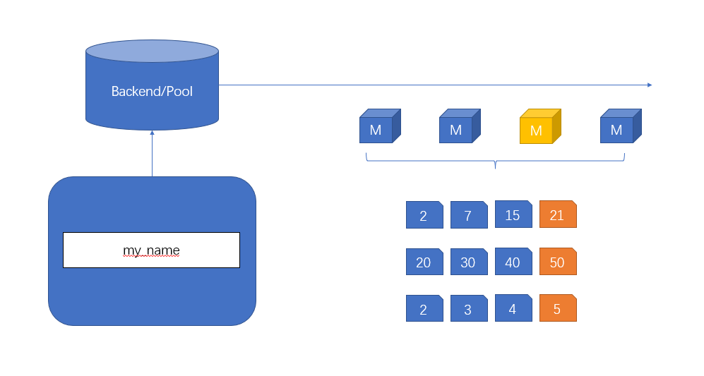

# 3CM
## 简介
在现有的Web3基础设施中，多链应用一直作为其中关键被重视与讨论。本项目提出了一种基于PoW的智能合约共识算法，并尝试将其应用于全链DID的构建。我们希望探索是否有一种技术可以在多链之间建立起联系，而又足够的简单和安全。 而当我们把跨链问题抽象成共识算法，一切将变得豁然开朗！
区块链共识让上万个节点数据保持同步，当我们将 PoW 从区块链底层移到智能合约之上，不同区块链上的智能合约将魔法般的具有同步能力。而这种同步能力将成为全链DID的基石。
## 基本架构
智能合约可以通过一定的方式集成源于比特币PoW共识底层机制，大致流程如图：

在本项目中，PoW的基本逻辑如下：用户提交链上交易请求至后端，获得出块权的矿工在多链上同时执行写入并打包交易，并通过L1的合约进行类似Rollup的验证（每个区块的区块信息作为一次交易被提交于L1上）。任何集成的链在本协议上的状态都会是同步的。
## 用例——DID
在本项目中，我们可以通过PoW机制实现DID的全链应用，而不必在每条链上分别注册。
例如，用户A发送注册交易到注册后端，一般DID使用单链环境进行处理，使其不能够达成多链的链上索引。而基于本协议，用户的一次注册便可以在全链进行同步，并且在每一条链上都可以实现链上索引。（此索引并非是在协议上，而是在每一条兼容链的合约中，即索引存储于各自链上）
在用户体验上，现有的DID一般只能应用于单链，注册成本和使用门槛较高，并且其体系较为割裂。而基于本协议，可以以一个DID串通全链，实现完整快捷的体验。
## 优势
### PoW的去信任化&简单性
相比于其他类型的共识机制，PoW机制本身为了达成共识，需要矿工们投入大量的计算资源。这使得攻击者在试图篡改网络时需要付出极高的成本，从而确保了区块链的安全性，其他共识算法可能在某些情况下面临较低的攻击门槛。由此可以得出：在一定情况下，PoW本身会比PoS更去中心化。而对应的，对于一个共识系统来说，其本质越去中心化，它本身的信任最小化（去信任化）程度就越高。在多链领域，常有因为中心化疏漏而导致的资产与信任流失，由此我们也应该明白，PoW机制正是解决这一领域中心化风险的良方。
同时，PoW本身在合约实现上的难度大幅低于PoS的实现，相对简单的共识机制相对应的安全系数也较高，可以保证系统的高去信任化程度。
### 多链同步
通过本协议可以实现方便快捷的多链同步，而这种同步本身在生态内的想象空间是巨大的。例如合约的多链部署、多链NFT的聚合交易等等。其中不同于其他跨链应用，用户只需一次交易便可于多链同时进行操作，大大减少了用户在EVM链上的交互成本。同时在未来也可以通过本协议扩展跨链合约的互操作性，在确保共识安全性的同时提高交互效率。
